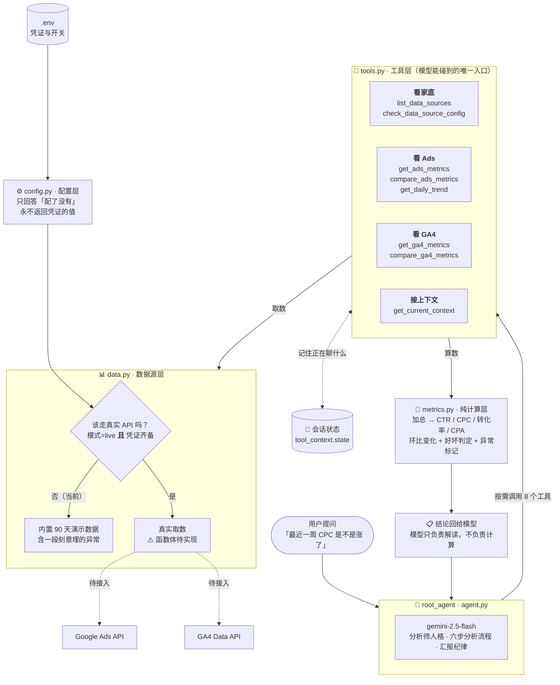

# 项目状态与架构

数字营销数据分析 Agent。基于 Google ADK 2.6.2，模型 `gemini-2.5-flash`。

> **本文件是本仓库的进度单一来源。** 每次 git 提交后都要更新它，
> 具体要求见文末[文档维护要求](#文档维护要求)。

**最近更新**：2026-08-26 ｜ **当前状态**：可运行（演示数据）｜ **测试**：27/27 通过

---

## 一句话说明

用户问一句「最近投放怎么样」，agent 去拉 Google Ads 和 GA4 的数据，
算出 CTR、CPC、转化率的变化，找出哪个广告系列、从哪天开始变差，
再给出可执行的优化建议。

目前跑的是**内置演示数据**，真实 API 的凭证和取数逻辑还没接（见下方[接入进度](#真实-api-接入进度)）。

---

## 架构图



**为什么要分这么多层**：一条红线——**数字由 Python 算，解读交给模型**。
CTR 算错一位就是错误的投放决策，所以计算全部收进 `metrics.py`，
它不依赖 ADK、不碰网络，因此可以单独跑测试验证对错。

---

## 文件职责

| 文件 | 职责 | 改动时要注意 |
|---|---|---|
| `agent.py` | 定义 `root_agent`：人格、分析流程、汇报纪律、挂哪些工具 | ADK 只认 `root_agent` 这个变量名 |
| `tools.py` | 模型能调的 8 个工具。翻译人话 → 取数 → 算数 → 整理结果 | 函数名+类型注解+docstring 就是模型的说明书，比函数体更重要 |
| `metrics.py` | 纯计算：聚合、派生指标、环比对比、好坏判定 | 不依赖 ADK，改动必须补测试 |
| `data.py` | 数据源：mock/live 分流 + 内置演示数据 + 真实 API 接缝 | 真实取数只需填两个 `_fetch_*_live` 函数体 |
| `config.py` | 读 `.env`，回答「配了没有」，产出待办清单 | **绝不能返回凭证的值**，有测试守着 |
| `test_metrics.py` | 27 个自检测试，不需要 pytest、不需要联网 | 改了计算或配置逻辑就要跑一遍 |
| `.env` | 真实凭证与数据源开关 | 已被 gitignore，永不提交 |
| `.env.example` | 可提交的配置模板，值全部为空 | 有测试检查它不含真值 |

---

## 已完成

- [x] **8 个分析工具**：家底查询、配置体检、Ads 快照、Ads 环比、GA4 快照、GA4 环比、逐日趋势、会话上下文
- [x] **指标口径正确**：CTR/CPC/转化率先加总再相除（不是按日平均），0 除数返回 `None` 而不是 0
- [x] **涨跌方向感知**：CTR 涨是好事、CPC 涨是坏事、花费涨算中性（可能是主动加预算），变化 <15% 算正常波动不报警
- [x] **异常定位链路**：环比找出「变差了」→ 逐日趋势找出「从哪天开始」→ GA4 交叉验证「问题在广告端还是站内」
- [x] **会话记忆**：记住正在分析的广告系列/渠道/窗口，能接住「那上周呢」这类省略句
- [x] **配置与凭证分离**：凭证全在 `.env`，代码只读键名；体检报告永不外泄凭证值
- [x] **双重安全阀**：模式=live **且**凭证齐备才走真实 API，否则退回演示数据；该用真实数据却用不了时明确报错，绝不拿假数据顶替
- [x] **演示数据可复现**：固定随机种子 + 锚定「今天」生成 90 天数据，最近 7 天给「春季新品-搜索」埋了 CPC 上涨 / CTR 下滑的异常
- [x] **依赖库已装**：`google-ads 31.4.0`、`google-analytics-data 0.23.0`

## 未完成

- [ ] **填 Google Ads 凭证**（5 项，developer token 需 Google 审核）
- [ ] **填 GA4 配置**（2 项：媒体资源 ID + 服务账号密钥路径）
- [ ] **实现真实取数逻辑**：`data.py` 的 `_fetch_ads_rows_live` / `_fetch_ga4_rows_live`，docstring 里已写好可照抄的实现步骤
- [ ] 评估测试（agent 回答质量的自动打分）
- [ ] 部署

**明确不做**：定时任务。被动触发是设计选择——每次分析都带着用户的具体问题，
不产出没人看的定时报告，也不在没人关注时白烧 API 配额。
真需要定期报告时由外部定时器触发一次对话即可，agent 这边不用改。

---

## 真实 API 接入进度

就绪度拆成三项分开看，因为三件事的负责人不一样：装库是环境问题，
填凭证要去申请，写取数逻辑是写代码。糊成一个「没配好」就不知道该干哪件。

| | 依赖库 | 凭证 | 取数逻辑 | 当前生效模式 |
|---|---|---|---|---|
| **Google Ads** | ✅ 已装 | ❌ 5 项待填 | ❌ 待实现 | 演示数据 |
| **GA4** | ✅ 已装 | ❌ 2 项待填 | ❌ 待实现 | 演示数据 |

随时可以问 agent「我还缺什么凭证」，它会调 `check_data_source_config` 报出
精确的缺失项和待办清单（只报键名，不报值）。

### 各家需要什么（已核对官方文档与已安装库的源码）

**Google Ads**（`.env` 里 5 项 + 1 项选填）

`GOOGLE_ADS_DEVELOPER_TOKEN`（需 Google 审核）、`CLIENT_ID`、`CLIENT_SECRET`、
`REFRESH_TOKEN`、`CUSTOMER_ID`（10 位纯数字，不带横线），
经理账号(MCC)访问子账号时再加 `LOGIN_CUSTOMER_ID`。

两个容易踩的点：`use_proto_plus=True` 是库的**硬性必填项**（写在代码里，不进 `.env`）；
`customer_id` 不是客户端配置，而是 `search_stream()` 的调用参数。

**GA4**（`.env` 里 2 项，就这两项，没有第三项）

`GA4_PROPERTY_ID`（纯数字，代码里拼成 `properties/<数字>`）、
`GA4_CREDENTIALS_JSON_PATH`（服务账号密钥文件的绝对路径）。

刻意**没有**用 Google 标准的 `GOOGLE_APPLICATION_CREDENTIALS`：那是全局凭证变量，
进程里所有 Google 客户端都读它。现在 ADK 走 API key 不受影响，
但将来若切到 Vertex 模式，Gemini 会突然拿 GA4 的服务账号去认证——
这种「改了 A 坏了 B」很难查。改成显式命名、显式传参就没这个问题。

另外提醒：服务账号还要在 GA4 后台「媒体资源访问管理」里加为**查看者**，否则报 403 而不是空数据。
密钥文件请放在仓库目录之外（`.gitignore` 已用 `*.json` 兜底拦截）。

---

## 怎么运行

```bash
# 启动 web 界面（在工作区根目录执行）
cd D:\Projects\adk-workspace
.venv\Scripts\activate
adk web
# 然后在左上角下拉里选 digital_marketing_agent

# 跑自检测试（不联网、不消耗 API 配额）
.venv\Scripts\python.exe -m digital_marketing_agent.test_metrics
```

可以试着问：「最近一周投放怎么样」「CPC 是不是涨了」「哪个广告系列拖后腿」
「从哪天开始变差的」「我还缺什么凭证」。

---

## 变更记录

新的记录加在最上面。

| 日期 | 类型 | 变更内容 |
|---|---|---|
| 2026-08-26 | feat | 初始化独立仓库。数据分析 agent 骨架 + 8 个工具 + 分层架构（agent/tools/metrics/data/config）+ 演示数据 + 27 个自检测试 |
| 2026-08-26 | feat | 凭证配置层：`.env` 加入 Ads/GA4 配置项与模式开关，`config.py` 只读键名不外泄值，`.env.example` 模板 |
| 2026-08-26 | fix | 核对官方文档后修正 GA4 配置：改用 `GA4_CREDENTIALS_JSON_PATH` 显式传参，替代全局的 `GOOGLE_APPLICATION_CREDENTIALS` |
| 2026-08-26 | chore | 安装 `google-ads 31.4.0`、`google-analytics-data 0.23.0`（纯新增依赖，未升降级既有包） |

---

## 文档维护要求

**每次 git 提交后，必须更新本文件。** 这不是可选项——本文件是本仓库进度的
单一来源，一旦过时，下次接手的人（包括几周后的你自己）就会被误导。

### 每次提交后要更新的三处

1. **顶部状态行**：`最近更新` 改成当天日期；测试数量有变就一起改
2. **变更记录**：在表格最上面加一行，写日期、类型、这次实际改了什么
3. **受影响的章节**：
   - 完成了某项 → 从「未完成」移到「已完成」，并勾上 `[x]`
   - 加了新文件 → 补进「文件职责」表
   - 改了架构或数据流 → 更新架构图
   - 接入状态有变（装了库 / 填了凭证 / 实现了取数）→ 更新接入进度表

### 三条约定

- **只有代码提交需要记录**，本文件自身的更新不必记进变更记录（否则会陷入
  「记录一条记录的记录」的无限循环）
- **写实际做了什么，不写打算做什么**。计划属于「未完成」清单，不属于变更记录
- **文档与代码不一致时，改文档**。代码是事实，文档是对事实的描述

### 提交信息格式

```
<类型>: <一句话说明>

<可选的正文：为什么这么改、踩了什么坑>
```

类型用 `feat`（新功能）、`fix`（修 bug）、`refactor`（重构）、`docs`（文档）、
`test`（测试）、`chore`（依赖/配置杂务）。
