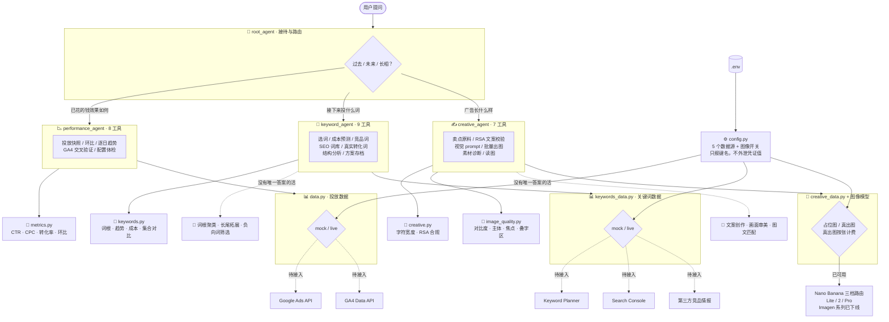

# 项目状态与架构

数字营销 agent。基于 Google ADK 2.6.2，模型 `gemini-2.5-flash`。

> **本文件是本仓库的进度单一来源。** 每次 git 提交后都要更新它，
> 具体要求见文末[文档维护要求](#文档维护要求)。

**最近更新**：2026-08-26 ｜ **当前状态**：可运行（演示数据）｜ **测试**：120/120 通过

---

## 一句话说明

两件事：

1. **投放表现分析** —— 用户问「最近投放怎么样」，agent 拉 Google Ads 和 GA4 数据，
   算出 CTR、CPC、转化率的变化，找出哪个广告系列、从哪天开始变差。
2. **关键词规划** —— 用户问「接下来投什么词」，agent 按行业/产品选词，
   预测搜索量趋势与投放成本，对比竞品投放词与自然搜索词库，
   由大模型做意图聚类、长尾拓展、负向词筛选，最后用 GA4 真实转化词校验方案。
3. **文案与视觉创意** —— 用户问「广告长什么样」，agent 基于产品卖点写多版本
   RSA 标题与描述并做严格字符校验，把营销主题转成图像 prompt 批量出图
   （1:1 / 1.91:1 / 9:16），再对素材做质量诊断（主体突出度、对比度、
   视觉焦点、叠字可读性、图文匹配度）。

目前跑的是**内置演示数据**，五个真实 API 的凭证和取数逻辑还没接
（见[接入进度](#真实-api-接入进度)）；图像生成默认走本地占位图，
真出图要显式打开开关（**按张计费**）。

---

## 目录结构

按"一个专员一个模块"组织，每个模块自带四层：agent（人格与流程）、
tools（模型能调的接口）、metrics（纯计算）、data（取数与接缝）。

```
digital_marketing_agent/
├── __init__.py               # 把 root_agent 转出来给 ADK 发现（关键，见下）
├── config.py                 # 全局配置 & 凭证诊断（5 个数据源 + 三档生图路由）
├── root_agent.py             # 根 agent：只做意图分发与全局路由，不挂业务工具
├── main.py                   # 启动入口：命令行对话 / 一次性提问 / Web 服务
├── session_state.py          # 共用的会话状态写入（原来三个模块各抄了一份）
│
├── sub_agents/
│   ├── performance/          # 1. 投放表现分析
│   │   ├── agent.py          # performance_agent
│   │   ├── tools.py          # 8 个工具
│   │   ├── metrics.py        # CTR / CPC / 转化率 / 环比
│   │   └── data.py           # Google Ads + GA4 取数与接缝
│   │
│   ├── keywords/             # 2. 关键词规划
│   │   ├── agent.py          # keyword_agent
│   │   ├── tools.py          # 9 个工具
│   │   ├── metrics.py        # 词根 / 趋势 / 成本预估 / 集合对比
│   │   ├── schema.py         # 数据形状契约（mock 与真实 API 共用）
│   │   ├── mock.py           # 演示词库生成（接真 API 后可整个删掉）
│   │   └── data.py           # 取数入口 + Keyword Planner / GSC / 竞品接缝
│   │
│   └── creative/             # 3. 营销文案与视觉创意
│       ├── agent.py          # creative_agent
│       ├── tools.py          # 文案工具 3 个
│       ├── visual_tools.py   # 视觉工具 3 个（唯一会花钱的地方）
│       ├── metrics.py        # 字符宽度 / RSA 合规校验
│       ├── image_quality.py  # 多模态图片诊断（Pillow）
│       └── data.py           # 卖点库 / 品牌风格 / 尺寸规范
│
├── tests/                    # 统一存放测试
│   ├── test_runner.py        # 共享运行器（不依赖 pytest）
│   ├── test_metrics.py       # 27 个
│   ├── test_keywords.py      # 42 个
│   ├── test_creative.py      # 40 个
│   └── test_structure.py     # 11 个：守住目录约定、拆分边界和入口
│
├── generated/                # 出图落盘处（已 gitignore）
├── .env / .env.example / .gitignore / PROJECT_STATUS.md
```

### ⚠️ ADK 发现机制：为什么 `__init__.py` 那一行不能删

ADK 找 agent 的顺序是（见 `adk/cli/utils/agent_loader.py`）：

1. 导入 `{包名}`，看**包上**有没有 `root_agent` 属性
2. 导入 `{包名}.agent`，看有没有 `root_agent`
3. 找 `{包名}/root_agent.yaml`

**ADK 不认识名叫 `root_agent.py` 的文件**——它只认 `agent.py` 或包属性。
本项目把根 agent 放在 `root_agent.py`（职责更清晰），所以完全依赖
`__init__.py` 里的 `from .root_agent import root_agent` 把它转出来。
删掉那一行，`adk web` 里就点不开这个 agent 了。
`tests/test_structure.py` 有一条断言专门守着它。

---

## 架构图



**贯穿全局的一条红线：数字由 Python 算，判断交给模型。**
CTR 算错一位就是错误的投放决策，所以计算全部收进 `metrics.py` 和 `keywords.py`——
它们不依赖 ADK、不碰网络，因此能单独跑测试验证对错。
模型只负责拿算好的数字去解读、聚类、取舍。

**为什么拆子 agent**：三块业务加起来 24 个工具。挂在一个 agent 上，
模型每次要在 24 个里挑，名字相近的（`get_ads_metrics` vs `plan_keywords`
vs `validate_ad_copy`）容易选错，instruction 也会因为要同时写三套流程而臃肿。
拆开后每个专员只面对自己的 7-9 个工具。

---

## 文件职责

改动某一层时只需要看那一层，不用翻别的文件。

| 文件 | 职责 | 改动时要注意 |
|---|---|---|
| `__init__.py` | 把 `root_agent` 转出来给 ADK 发现 | **那一行不能删**，见上方 ADK 发现机制 |
| `root_agent.py` | 只做意图分发与路由 | 不该挂任何业务工具，有测试守着 |
| `main.py` | 启动入口（CLI / 一次性提问 / Web） | 必须自己调 `config.load()` 加载 `.env`，ADK CLI 才会替你做 |
| `config.py` | 读 `.env`，回答「配了没有」，产出待办清单 | **绝不能返回凭证的值**，有测试守着 |
| `sub_agents/*/agent.py` | 该专员的人格、流程、汇报纪律、挂哪些工具 | 只定义 agent，不写业务逻辑 |
| `sub_agents/*/tools.py` | 模型能调的接口 | 函数名+类型注解+docstring 就是模型的说明书 |
| `sub_agents/*/metrics.py` | 纯计算层 | 不依赖 ADK，改动必须补测试 |
| `sub_agents/*/data.py` | 取数与真实 API 接缝 | 真实取数只需填 `_fetch_*_live` 函数体 |
| `session_state.py` | 共用的会话状态写入 | 三个模块共用，别再各抄一份 |
| `sub_agents/keywords/schema.py` | 数据形状契约 | 不许 import mock，否则删 mock 会带走契约 |
| `sub_agents/keywords/mock.py` | 演示词库生成 | 接上真 API 后可整个删掉，删除边界要保持干净 |
| `sub_agents/creative/visual_tools.py` | 视觉工具：prompt、出图、诊断 | **唯一会花钱的文件**，成本护栏都在这里 |
| `sub_agents/creative/image_quality.py` | 图片客观指标（Pillow） | 只用 Pillow，不引 numpy |
| `tests/test_runner.py` | 共享测试运行器 | 不依赖 pytest，同时兼容 pytest 收集 |
| `tests/test_structure.py` | 守住目录约定与入口 | 重构目录后第一个要跑的就是它 |
| `.env` | 真实凭证与开关 | 已 gitignore，永不提交 |
| `.env.example` | 可提交的配置模板 | 有测试检查它不含真值 |

每个模块的四层分工：**agent** 定人格与流程，**tools** 给模型接口，
**metrics** 算准数字，**data** 管取数。跨模块共用的只有 `config.py` 和 `session_state.py`。

### 哪些文件拆了、哪些没拆（以及为什么）

拆分的判据是**有没有真实收益**，不是行数好看：

| 文件 | 原行数 | 处理 | 理由 |
|---|---|---|---|
| `creative/tools.py` | 664 | **拆成 tools + visual_tools** | 文案和出图是两件不相干的事，依赖也不同（Pillow / 图像模型只有视觉侧需要）。拆开后文案侧不再拖进图片依赖，成本护栏也集中到一个文件里好审 |
| `keywords/data.py` | 560 | **拆成 schema + mock + data** | 形状是契约、mock 是内容、data 是入口。接上真 API 后 `mock.py` 可以整个删掉，删除边界干净 |
| `keywords/tools.py` | 592 | **不拆** | 9 个工具是**一条工作流**（摸范围→选词→转化锚→竞品/SEO→结构→存档→预测），依赖完全相同。拆开只会把一条流程散到两个文件，没有任何依赖收益 |
| `performance/tools.py` | 430 | 不拆 | 未到需要拆的规模 |

有测试盯着拆分边界：`schema.py` 不许 import mock、文案工具里不许出现 Pillow
和图像模型调用、三个模块不许再各抄一份会话写入函数。

## 已完成

### 投放表现分析

- [x] 8 个工具：家底查询、配置体检、Ads 快照/环比、GA4 快照/环比、逐日趋势、会话上下文
- [x] **指标口径正确**：CTR/CPC/转化率先加总再相除（不是按日平均），0 除数返回 `None` 而不是 0
- [x] **涨跌方向感知**：CTR 涨是好事、CPC 涨是坏事、花费涨算中性（可能是主动加预算），变化 <15% 不报警
- [x] **异常定位链路**：环比找「变差了」→ 逐日趋势找「从哪天开始」→ GA4 交叉验证「广告端还是站内」

### 关键词规划

- [x] **9 个工具**：范围查询、选词、成本预测、竞品词、SEO 词库、真实转化词、结构分析、方案存档、会话上下文
- [x] **按行业/产品选词**：搜索量、CPC、竞争度、首页出价区间，字段对齐 Keyword Planner
- [x] **搜索量趋势**：12 个月序列压成「在涨/在跌/平稳 + 旺季是哪月 + 季节性倍数」，
      用最近 3 月均值 vs 前 3 月均值对比，避免把单月噪声当趋势
- [x] **成本预测**：预计点击、月花费、均价，**并强制带上假设值警告**（点击率是经验假设，不是承诺）
- [x] **竞品缺口分析**：传入我方词表才算缺口，输出「都在投/只有我投/只有它投」
- [x] **SEO 词库**：点击、曝光、点击率、平均排名，附带匿名化查询的完整性提醒
- [x] **GA4 转化归因**：真实转化过的搜索词 + 转化率 + 单次会话价值，作为规划的锚点
- [x] **语义活交给模型**：`analyze_keyword_structure` 只给确定性原料（词根分组、重复项、
      负向规则命中、跨来源覆盖），聚类/长尾/负向筛选明确交回模型判断
- [x] **方案存档带校验**：`record_keyword_plan` 会拦住跨组重复和「既投又排除」的自相矛盾

### 文案与视觉创意

- [x] **7 个工具**：范围查询、卖点原料、RSA 校验、视觉 prompt、批量出图、素材诊断、读图
- [x] **字符宽度按 Google 口径算**：全角字符每个算 2 个单位，
      所以纯中文标题实际 15 字、描述 45 字。中英混排逐字符累加，天然正确
- [x] **校验结果可直接行动**：告诉模型"超了几个单位、约需删几个汉字、还能再写几个字"，
      而不是只说"超限了"
- [x] **合规规则分级**：官方明令禁止的（连续标点、滥用大写、逐字母加点、写电话号码、
      素材重复）判 error 阻塞提交；本项目的保守偏好（少用感叹号）判 warning 不阻塞
- [x] **卖点分六维度铺开**：痛点/优惠/信任/服务/功能/场景，并报出哪些维度缺料
- [x] **视觉 prompt 带品牌一致性**：主色、氛围、光线、构图从品牌风格预设注入
- [x] **1.91:1 的裁剪方案**：图像模型不支持 1.91:1，按 16:9 生成后居中裁剪，
      并提醒 prompt 里让主体避开上下边缘
- [x] **出图成本护栏**：默认 mock 画本地占位图（零成本），live 需显式开启，
      单次出图有硬上限，占位图明确标注"不能投放"
- [x] **素材诊断分两层**：Pillow 算客观指标（对比度、主体突出度、九宫格视觉焦点、
      最适合叠字的区域、叠字对比度是否达 WCAG 4.5），
      再把图存成 artifact 让模型调 load_artifacts **亲眼看**，判断吸引力与图文匹配

### 架构与安全

- [x] **拆子 agent**：root 路由 + performance_agent + keyword_agent + creative_agent，各管自己的工具
- [x] **凭证与配置分离**：五个数据源的凭证全在 `.env`，代码只读键名
- [x] **配置体检不外泄凭证值**，只返回键名与是否已配置（有测试守着）
- [x] **双重安全阀**：模式=live **且**凭证齐备才走真实 API，否则退回演示数据
- [x] **该用真实数据却用不了时明确报错**，绝不拿演示数据顶替
- [x] **依赖库已装**：`google-ads 31.4.0`、`google-analytics-data 0.23.0`、`google-api-python-client`、`Pillow 12.3.0`

## 未完成

- [ ] **填 Google Ads 凭证**（5 项，developer token 需 Google 审核；Keyword Planner 共用这套）
- [ ] **填 GA4 配置**（2 项）
- [ ] **填 Search Console 配置**（2 项，注意服务账号可用性未经官方确认）
- [ ] **买第三方竞品情报**（2 项：端点 + 密钥）
- [ ] **实现 5 个真实取数函数**：`data.py` 两个、`keywords_data.py` 四个（GA4 那个两处共用）
- [ ] **真出图**：把 `.env` 的 `IMAGE_GENERATION_MODE` 改成 `live`（按张计费，需已开通付费）。
      代码路径已写好并对照本账号可用模型核对过，但**没有花钱实测过一次**
- [ ] 评估测试（agent 回答质量的自动打分）
- [ ] 部署

**明确不做**：定时任务。被动触发是设计选择——每次分析都带着用户的具体问题，
不产出没人看的定时报告，也不在没人关注时白烧 API 配额。
真需要定期报告时由外部定时器触发一次对话即可，agent 这边不用改。

---

## 真实 API 接入进度

就绪度拆成三项分开看，因为三件事的负责人不一样：装库是环境问题，
填凭证要去申请，写取数逻辑是写代码。糊成一个「没配好」就不知道该干哪件。

| 数据源 | 依赖库 | 凭证 | 取数逻辑 | 生效模式 |
|---|---|---|---|---|
| **Google Ads**（投放数据） | ✅ 已装 | ❌ 5 项待填 | ❌ 待实现 | 演示数据 |
| **GA4**（站内数据 + 转化词） | ✅ 已装 | ❌ 2 项待填 | ❌ 待实现 | 演示数据 |
| **Keyword Planner**（选词） | ✅ 已装 | ❌ 共用 Ads 凭证 | ❌ 待实现 | 演示数据 |
| **Search Console**（SEO 词库） | ✅ 已装 | ❌ 2 项待填 | ❌ 待实现 | 演示数据 |
| **第三方竞品情报** | ✅ 无需专用库 | ❌ 2 项待填 | ❌ 待实现 | 演示数据 |
| **图像生成**（出图） | ✅ 已装 Pillow | ✅ API key 已配 | ✅ 已写好 | **本地占位图**（开关未开） |

随时可以问 agent「我还缺什么凭证」，它会调 `check_data_source_config`
报出精确的缺失项和待办清单（只报键名，不报值）。

### 各家需要什么（已核对官方文档与已安装库的源码）

**Google Ads + Keyword Planner**（`.env` 5 项 + 1 项选填，两者共用）

`GOOGLE_ADS_DEVELOPER_TOKEN`（需 Google 审核）、`CLIENT_ID`、`CLIENT_SECRET`、
`REFRESH_TOKEN`、`CUSTOMER_ID`（10 位纯数字不带横线），MCC 经理账号再加 `LOGIN_CUSTOMER_ID`。

两个容易踩的点：`use_proto_plus=True` 是库的**硬性必填项**（写在代码里，不进 `.env`）；
`customer_id` 不是客户端配置，而是调用参数。

选词用 `KeywordPlanIdeaService.generate_keyword_ideas()`，返回的 `keyword_idea_metrics`
里带 `avg_monthly_searches`、`competition`、`average_cpc_micros` 和
`monthly_search_volumes`（12 个月趋势）。所有 micros 字段除以 1,000,000 才是元。
**用户意图 API 不提供**，得靠大模型判断。

**GA4**（`.env` 2 项）

`GA4_PROPERTY_ID`（纯数字，拼成 `properties/<数字>`）、`GA4_CREDENTIALS_JSON_PATH`。

刻意**不用** Google 标准的 `GOOGLE_APPLICATION_CREDENTIALS`：那是全局凭证变量，
进程里所有 Google 客户端都读它，将来 ADK 切到 Vertex 模式会互相干扰。

搜索词维度：`sessionGoogleAdsKeyword`（你出价的词）、`sessionGoogleAdsQuery`（用户真实搜的词）、
`searchTerm`（站内搜索框，仅事件级）。**GA4 没有任何自然搜索关键词维度**——
自然搜索的词只能从 Search Console 拿，这就是为什么要同时接这两个源。

指标要用新名字：**`conversions` 已废弃**，2024-05 起改名 `keyEvents`
（`sessionConversionRate` → `sessionKeyEventRate`）。且 `keyEvents` 是所有关键事件的合计，
要看单个转化得加 `eventName` 维度 + 过滤器。

**Search Console**（`.env` 2 项）

`SEARCH_CONSOLE_SITE_URL`、`SEARCH_CONSOLE_CREDENTIALS_JSON_PATH`。
scope 用 `https://www.googleapis.com/auth/webmasters.readonly`。

siteUrl 两种写法必须与后台完全一致：URL 前缀属性 `https://example.com/`（含结尾斜杠），
或域名属性 `sc-domain:example.com`（覆盖全部子域与协议，需 DNS 验证）。

客户端是 `build('searchconsole', 'v1', ...)`，调 `searchanalytics().query()`。
四个坑：**返回的 ctr 是 0~1 小数不是百分比**；`rowLimit` 默认 1000、上限 25000，
更多要用 `startRow` 翻页；数据有 2~3 天延迟；**搜索量过少的词会被匿名化隐去**，
所以所有 query 行的点击加起来永远小于站点总点击，翻页也补不回来。

⚠️ **服务账号能否用于 Search Console，官方文档并未说明。** 社区做法是把服务账号邮箱
加为站点用户，但未经官方确认。真接的时候要留验证时间，必要时改用普通 OAuth 用户授权。

**第三方竞品情报**（`.env` 2 项）

`COMPETITOR_INTEL_BASE_URL`、`COMPETITOR_INTEL_API_KEY`。

竞品投放词 Google 官方不提供（Ads API 只能看自己的账户），只能买第三方数据
（SEMrush / Ahrefs / SpyFu / DataForSEO 等）。这里刻意做成**厂商中立**：
只认端点和密钥，换厂商只改 `keywords_data.py` 里一个函数。

两个提醒：第三方数据是**估算**不是竞品真实数据，只能判断方向；
这类接口按调用次数计费，别在循环里逐词查。

---

### 图像生成：Imagen 已下线，改用 Gemini 原生图像模型

⚠️ **这一条推翻了常见做法，务必知道**：用本账号的 API key 调
`client.models.list()` 实测，**列表里没有任何 `imagen-*` 模型**。
Imagen 3 已在 Gemini API 下线，Imagen 4 也已到停用日期。
所以网上大量教程里的 `client.models.generate_images()`（Imagen 的 predict 接口）
在这里根本调不通。

### 三档模型路由

对外只暴露 `draft` / `standard` / `premium` 三个档位名，不让模型直接填模型 ID——
模型 ID 会变（现在就已经换过一代），档位名不会。
对应关系是用本账号 `models.list()` 读 `display_name` 核对出来的：

| 档位 | 模型 ID | display_name | 定位 | 用在哪 |
|---|---|---|---|---|
| `draft` | `gemini-3.1-flash-lite-image` | Nano Banana 2 Lite | 极致性价比、高并发 | 社媒缩略图批量、多方案草稿预览、大规模自动化素材测试 |
| `standard` | `gemini-3.1-flash-image` | Nano Banana 2 | 速度与质量平衡（**默认档**） | 标准营销 Banner、电商产品背景替换、响应式广告素材 |
| `premium` | `gemini-3-pro-image` | Nano Banana Pro | SOTA 顶级视觉效果 | 品牌主海报、高精修宣发图、对文字排版与逼真度要求极高的精品素材 |

旧的 `gemini-2.5-flash-image`（display_name 就叫 "Nano Banana"）已移除。

用法：`render_visual_assets(..., quality="draft")`。档位名填错会**回退到默认档
并如实标注**，不抛异常——档位是模型填的，偶尔填错不该让整轮对话崩掉。

省钱的用法是 **draft 出多版草稿 → 用户挑中一版 → premium 精修**，
比全程 premium 便宜得多。agent 的 instruction 里写了这条纪律。

每档的模型 ID 都能在 `.env` 里单独覆盖（`IMAGE_MODEL_DRAFT` / `_STANDARD` / `_PREMIUM`），
模型换代时不用改代码。

正确的调用方式：

```python
client.models.generate_content(
    model="gemini-3.1-flash-image",
    contents=prompt,
    config=types.GenerateContentConfig(
        response_modalities=["IMAGE"],
        image_config=types.ImageConfig(aspect_ratio="16:9"),
    ),
)
# 图片在 response.candidates[0].content.parts[i].inline_data.data
```

三个连带影响：

1. **没有 1.91:1 这个比例**。支持的是 1:1 / 3:4 / 4:3 / 9:16 / 16:9 这类
   （Nano Banana 系列多几个，但依然没有 1.91:1）。
   所以横版 banner 只能按 16:9 生成再居中裁剪——prompt 里要让主体避开上下边缘。
2. **负向 prompt 已失效**。当前这代模型不再支持单独的 negative prompt，
   不要的元素必须写进正向 prompt 的 Avoid 从句。
3. **免费额度不覆盖图像生成**，需要账号已开通付费。所以默认 mock。

配置项在 `.env`：`IMAGE_GENERATION_MODE`（mock/live）、`IMAGE_MODEL`、
`IMAGE_MAX_PER_CALL`（单次出图上限，硬上限 6）。
刻意和 `DATA_SOURCE_MODE` 分成两个开关——取数是只读的，出图是**真花钱**。

---

## 怎么运行

全部命令在工作区根目录 `D:\Projects\adk-workspace` 下执行。

```bash
# ---- 三种启动方式 ----
# 1) 网页界面（原来的方式，仍然可用）
.venv\Scripts\activate && adk web        # 左上角下拉里选 digital_marketing_agent

# 2) 命令行对话（无需浏览器，适合服务器 / SSH）
.venv\Scripts\python.exe -m digital_marketing_agent.main

# 3) 一次性提问，问完退出（适合挂定时任务跑日报）
.venv\Scripts\python.exe -m digital_marketing_agent.main --ask "最近一周投放怎么样"

# 也可以用 main.py 代起网页服务，省得记参数
.venv\Scripts\python.exe -m digital_marketing_agent.main --web --port 8000

# ---- 跑自检测试（不联网、不消耗 API 配额）----
.venv\Scripts\python.exe -m digital_marketing_agent.tests.test_metrics     # 27 个
.venv\Scripts\python.exe -m digital_marketing_agent.tests.test_keywords    # 42 个
.venv\Scripts\python.exe -m digital_marketing_agent.tests.test_creative    # 40 个
.venv\Scripts\python.exe -m digital_marketing_agent.tests.test_structure   # 11 个
```

> 命令行入口用的是内存会话，进程退出后对话历史就没了。
> 学习阶段够用；要持久化把 `InMemorySessionService` 换成数据库版即可，agent 不用改。

生成的图片落在 `generated/`（已 gitignore）。mock 模式下是**占位图，不能投放**。

可以试着问：

| 问什么 | 会转交给 |
|---|---|
| 最近一周投放怎么样 / CPC 是不是涨了 / 哪个广告系列拖后腿 | performance_agent |
| 从哪天开始变差的 / 我还缺什么凭证 | performance_agent |
| 运动户外这个行业该投什么词 / 这批词要花多少钱 | keyword_agent |
| 竞品在投什么 / 哪些词该加进负向词 / 关键词怎么分组 | keyword_agent |
| 给跑鞋写一套搜索广告文案 / 标题超字数了帮我压一下 | creative_agent |
| 生成三个尺寸的 banner / 这张素材行不行 / 图文搭不搭 | creative_agent |
| 哪些词表现差、该换成什么词、再写套文案 | 依次转交三个专员，一次一个 |

---

## 变更记录

新的记录加在最上面。

| 日期 | 类型 | 变更内容 |
|---|---|---|
| 2026-08-27 | feat | **生图改为 Nano Banana 三档路由**：draft / standard / premium 对应 Lite / 2 / Pro，模型 ID 用账号 `models.list()` 的 display_name 核对；移除旧的 `gemini-2.5-flash-image`；对外只暴露档位名，档位填错回退不崩；agent 指令加"先 draft 草稿再 premium 精修"的省钱纪律 |
| 2026-08-27 | refactor | **拆分过长文件**：`creative/tools.py` 664 行拆成 tools（文案）+ visual_tools（视觉）；`keywords/data.py` 560 行拆成 schema（契约）+ mock（演示数据）+ data（取数入口）；`keywords/tools.py` 592 行**刻意不拆**（是一条工作流，无依赖收益） |
| 2026-08-27 | refactor | 三个模块各抄一份的 `_remember` 提取为包级 `session_state.remember` |
| 2026-08-26 | refactor | **按模块重组目录**。三个专员各成一个包（`sub_agents/<模块>/` 下 agent/tools/metrics/data 四层），根 agent 拆成只做路由的 `root_agent.py`，测试统一进 `tests/`；新增 `main.py` 启动入口（CLI 对话 / 一次性提问 / Web）与 8 个结构测试 |
| 2026-08-26 | fix | `main.py` 启动时必须自己调 `config.load()`——ADK CLI 会替你加载 `.env`，自定义入口不会，实测报 "No API key was provided" |
| 2026-08-26 | feat | **营销文案与视觉创意**。新增 `creative_data.py` / `creative.py` / `image_quality.py` / `creative_tools.py`（7 个工具）：RSA 多版本文案 + 全角字符严格校验、卖点六维度覆盖、视觉 prompt 构筑、三尺寸批量出图（含 1.91:1 裁剪）、素材质量诊断（客观指标 + 交模型读图）；新增 36 个测试 |
| 2026-08-26 | refactor | 架构加入第三个专员 `creative_agent`，root 路由改为「过去/未来/长相」三分 |
| 2026-08-26 | fix | 实测本账号 `models.list()` 后确认 **Imagen 系列已在 Gemini API 全部下线**，改用 `gemini-3.1-flash-image` 走 `generate_content` + `image_config`；负向 prompt 已失效，排除项改写进正向 prompt |
| 2026-08-26 | fix | 核对官方政策后修正感叹号规则：「标题不用感叹号」是 AdWords 旧指南、现行政策查不到，降级为 warning 不再阻塞提交 |
| 2026-08-26 | chore | 安装 `Pillow 12.3.0`（图片指标计算与占位图）；`.env` 加入图像生成开关 |
| 2026-08-26 | feat | **关键词规划功能**。新增 `keywords_data.py` / `keywords.py` / `keyword_tools.py`（9 个工具），覆盖行业选词、搜索量趋势与成本预测、竞品词缺口、SEO 词库、GA4 转化归因、意图聚类原料与方案存档；新增 42 个测试 |
| 2026-08-26 | refactor | 架构拆成 root_agent 路由 + performance_agent + keyword_agent 两个专员；测试运行器提取为共享 `test_runner.py` |
| 2026-08-26 | feat | config 扩展到 5 个数据源（新增 Keyword Planner / Search Console / 第三方竞品情报），`.env` 与模板同步 |
| 2026-08-26 | fix | 核对官方 schema 后修正 GA4 指标名：`conversions` 已废弃，改用 `keyEvents` |
| 2026-08-26 | chore | 安装 `google-api-python-client`（Search Console 用） |
| 2026-08-26 | feat | 初始化独立仓库。数据分析 agent 骨架 + 8 个工具 + 分层架构 + 演示数据 + 27 个自检测试 |
| 2026-08-26 | feat | 凭证配置层：`.env` 加入 Ads/GA4 配置项与模式开关，`config.py` 只读键名不外泄值，`.env.example` 模板 |
| 2026-08-26 | fix | 核对官方文档后修正 GA4 配置：改用 `GA4_CREDENTIALS_JSON_PATH` 显式传参，替代全局的 `GOOGLE_APPLICATION_CREDENTIALS` |
| 2026-08-26 | chore | 安装 `google-ads 31.4.0`、`google-analytics-data 0.23.0`（纯新增依赖，未升降级既有包） |

---

## 文档维护要求

**每次 git 提交后，必须更新本文件。** 这不是可选项——本文件是本仓库进度的
单一来源，一旦过时，下次接手的人（包括几周后的你自己）就会被误导。

### 每次提交后要更新的三处

1. **顶部状态行**：`最近更新` 改成当天日期；测试数量有变就一起改
2. **变更记录**：在表格最上面加一行，写日期、类型、这次实际改了什么
3. **受影响的章节**：
   - 完成了某项 → 从「未完成」移到「已完成」，并勾上 `[x]`
   - 加了新文件 → 补进「文件职责」表
   - 改了架构或数据流 → 更新架构图
   - 接入状态有变（装了库 / 填了凭证 / 实现了取数）→ 更新接入进度表

### 三条约定

- **只有代码提交需要记录**，本文件自身的更新不必记进变更记录（否则会陷入
  「记录一条记录的记录」的无限循环）
- **写实际做了什么，不写打算做什么**。计划属于「未完成」清单，不属于变更记录
- **文档与代码不一致时，改文档**。代码是事实，文档是对事实的描述

### 提交信息格式

```
<类型>: <一句话说明>

<可选的正文：为什么这么改、踩了什么坑>
```

类型用 `feat`（新功能）、`fix`（修 bug）、`refactor`（重构）、`docs`（文档）、
`test`（测试）、`chore`（依赖/配置杂务）。
