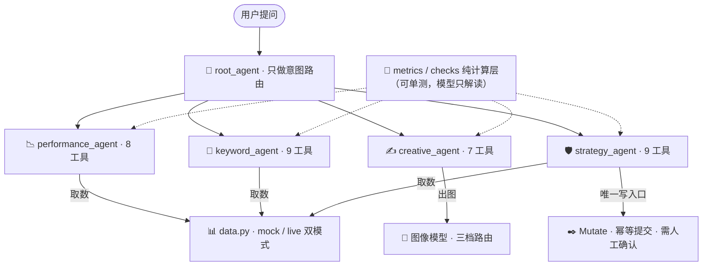

# digital_marketing_agent

数字营销 agent：一个用 **Google ADK** 构建的四人营销团队，负责 Google Ads 投放的分析、规划、创意与风控。

> 学习项目：从单 agent + 4 个工具起步，逐步演进为多 agent 架构 + 专属 Web UI。
> 进度的单一来源见 [PROJECT_STATUS.md](PROJECT_STATUS.md)（每次提交后更新）。

## 它能做四件事

| 问题 | 负责的专员 | 能力 |
|---|---|---|
| "最近投放怎么样" | 📉 **投放表现分析** | 拉取 Ads / GA4 数据，算 CTR、CPC、转化率环比，定位哪个系列、从哪天开始变差，GA4 交叉验证是广告端还是站内问题 |
| "接下来投什么词" | 🔑 **关键词规划** | 按行业/产品选词，预测搜索量趋势与投放成本，竞品词缺口分析，SEO 词库，GA4 真实转化词校验 |
| "广告长什么样" | ✍️ **文案与视觉创意** | 基于产品卖点写多版本 RSA 文案（字符宽度按 Google 口径严格校验），三尺寸批量出图，素材客观质量诊断 |
| "这方案能上吗、安不安全" | 🛡️ **投放策略与风控** | 预算/出价阀门校验，敏感词合规扫描，逻辑矛盾拦截，Google Ads Mutate 原子提交，上线后 48 小时冷启动熔断护航 |

## 贯穿全局的三条设计红线

1. **数字由 Python 算，判断交给模型**——CTR 算错一位就是错误的投放决策，所有计算收进不依赖 ADK、不碰网络的纯计算层，190 个测试单测验证。
2. **零自动写操作**——全系统唯一能改动广告账号的入口挂在两个人工确认后面（`require_confirmation=True`），熔断也只产出"待批的暂停动作"，不存在任何自动改账号的路径。
3. **凭证永不外泄**——`.env` 存凭证，代码只读键名；所有配置体检接口只回答"配了没有"，永不返回值（有测试守着）。

## 架构



每个专员模块自带四层：**agent**（人格与流程）、**tools**（模型能调的接口）、**metrics/checks**（纯计算）、**data**（取数与真实 API 接缝）。真实 API 的取数函数留了接缝（`_fetch_*_live`），目前跑内置演示数据。

## 快速开始

环境：Python 3.10+，Windows / macOS / Linux 均可（本项目在 Windows 上开发）。

```bash
# 1) 安装依赖（google-adk 及数据源库）
pip install google-adk google-ads google-analytics-data google-api-python-client Pillow sqlalchemy aiosqlite

# 2) 配置凭证：复制模板并填入 GOOGLE_API_KEY
cp .env.example .env

# 3) 跑自检测试（190 个，不联网、不耗 API 配额）
python -m digital_marketing_agent.tests.test_metrics     # 27
python -m digital_marketing_agent.tests.test_keywords    # 42
python -m digital_marketing_agent.tests.test_creative    # 40
python -m digital_marketing_agent.tests.test_strategy    # 69
python -m digital_marketing_agent.tests.test_structure   # 12
```

### 三种使用方式

```bash
# A) 命令行对话
python -m digital_marketing_agent.main

# B) 一次性提问（适合挂定时任务跑日报）
python -m digital_marketing_agent.main --ask "最近一周投放怎么样"

# C) 专属 Web UI「投放作战室」——两个终端
python -m digital_marketing_agent.web.server          # 后端 FastAPI :8001
cd web/frontend && npm install && npm run dev         # 前端 Next.js :3000
```

Web UI 是对话式控制台：工具返回值渲染成结构化卡片（KPI 环比行、逐日趋势图、关键词表、RSA 字符校验、出图画廊、审查清单、**人工确认卡**），三盏安全状态灯常驻顶栏，会话持久化在 SQLite。详见 [web/README.md](web/README.md)。

## 目录结构

```
digital_marketing_agent/
├── root_agent.py          # 根 agent：意图分发与路由，不挂业务工具
├── config.py              # 凭证与开关体检（只报键名，不报值）
├── main.py                # 启动入口：CLI / 一次性提问 / Web
├── session_state.py       # 共用的会话状态写入
├── sub_agents/
│   ├── performance/       # 投放表现分析（agent/tools/metrics/data）
│   ├── keywords/          # 关键词规划（+ schema 契约层、mock 演示层）
│   ├── creative/          # 文案与视觉创意（+ 图片质量诊断）
│   └── strategy/          # 投放策略与风控（+ payload 构造、幂等账本）
├── tests/                 # 190 个自检测试（不依赖 pytest）
└── web/                   # 专属 Web UI（FastAPI + Next.js）
```

## 当前状态

- ✅ 四位专员 33 个工具全部可用（演示数据）
- ✅ 专属 Web UI：对话流 + 结构化卡片 + 人工确认闭环 + 配置中心
- ⏳ 真实 API 接入中：Google Ads / GA4 / Keyword Planner / Search Console / 竞品情报（凭证申请 + 取数函数待补，见 [PROJECT_STATUS.md](PROJECT_STATUS.md) 的接入进度表）
- 🚫 明确不做定时任务：被动触发是设计选择

详细的进度、已查证的 API 事实、踩过的坑，全部记录在 [PROJECT_STATUS.md](PROJECT_STATUS.md)。
